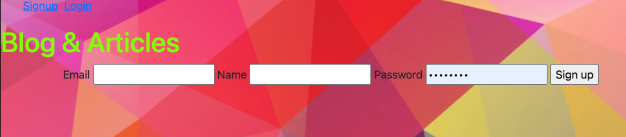

#  `1`  Blog Articles and Dream Journal

Article blog with some added tools such as a dream journal, clock, and random jokes to elevate the mood.

## `2` Fork & Clone / Link access
First thing to do is `fork` and `clone` or use the direct link access: 
https://blog-articles-dreams.herokuapp.com/auth/login

## `3` What it includes and technologies used

* API to generate randome jokes Posts
* Sequelize user model / migration
* Settings for PostgreSQL
* Passport and passport-local for authentication
* Sessions to keep user logged in between pages
* Flash messages for errors and successes
* Passwords that are hashed with BCrypt
* EJS Templating and EJS Layouts

### User Model and attributes

## `4` How to use
Log or signup with an email to access randoms joke, create an article, or make your diary. Links with navigation buttons are provided everywhere for other options or to return a page.

## `6` Future considerations.
Turn into an all in one tool with functions to:

`1` Add images to articles.

  `2` Bugs tracker with decks to update works or tickets, available to be view only by concerned users. 

## `7` Now put down your morning thoughts or have some good jokes.

